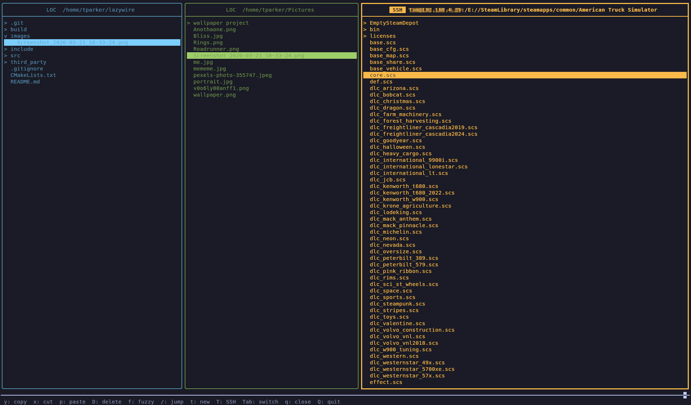

# lazywire

A terminal UI file manager for managing files across local and remote machines over SSH/SCP.



## Usage

**Launch with a remote connection:**
```
lazywire user@host
```
You'll be prompted for the password (no echo), just like `ssh`. Launches directly into a session with that remote.

**Launch without args:**
```
lazywire
```
Opens the TUI where you can add remote connections manually.

## Navigation

- `hjkl` or arrow keys to move
- `Space` to expand/collapse folders
- `Tab` to switch between panes

## Jump Mode

Press `/` and type a path to jump directly to any location — works like `cd` with real-time path matching as you type.

## Fuzzy Find

Press `f` to fuzzy search recursively within the currently open directory.

## File Operations

| Key | Action |
|-----|--------|
| `y` | Yank (copy) — clears any previous yank |
| `Y` | Add to yank list (multi-yank) |
| `x` | Cut |
| `p` | Paste all yanked items into selected folder (or current dir) |
| `d` | Delete (confirmation required) |
| `r` | Rename |
| `m` | New directory |
| `Esc` | Clear yank selection |

Operations work across panes — yank from local, paste to remote, and vice versa. Multi-yank works across different panes and remotes.

## Pane Management

| Key | Action |
|-----|--------|
| `t` | New local pane at launch directory |
| `T` | New SSH pane |
| `Tab` | Switch active pane |
| `q` | Close active pane |
| `Q` | Quit |
| `Ctrl+R` | Refresh pane |

## Batch Mode

Press `Shift+Tab` to toggle batch mode. In batch mode, file operations are queued rather than executed immediately — useful for staging a set of changes before committing them.

| Key | Action |
|-----|--------|
| `Ctrl+E` | Execute queued operations |
| `Ctrl+U` | Clear queue |

## Help

Press `?` at any time to show all keybindings. Press any key to close.

## Installation

### Dependencies

| Dependency | Purpose | Install |
|------------|---------|---------|
| `libssh` | SSH/SCP connections | `sudo apt install libssh-dev` |
| `pkg-config` | Build-time dependency resolution | `sudo apt install pkg-config` |
| `cmake` (3.15+) | Build system | `sudo apt install cmake` |
| `g++` / `clang++` | C++17 compiler | `sudo apt install build-essential` |
| [FTXUI](https://github.com/ArthurSonzogni/FTXUI) | TUI framework | Fetched automatically by CMake |

On Debian/Ubuntu, install everything at once:
```
sudo apt install build-essential cmake pkg-config libssh-dev
```

### Build

```
git clone git@github.com:yourusername/lazywire.git
cd lazywire
cmake -B build
cmake --build build
```

The binary will be at `build/lazywire`. Optionally install it to your PATH:
```
sudo cp build/lazywire /usr/local/bin/
```
